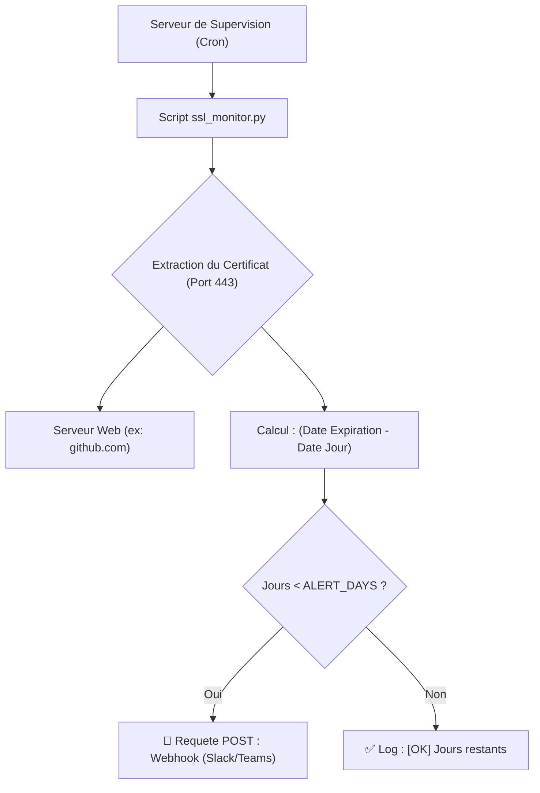

#  SSL Expiry Monitor & Webhook Alerter

L'oubli du renouvellement d'un certificat TLS/SSL est une cause majeure d'interruption de service (Outage). Plutôt que de dépendre de services SaaS externes payants, ce script Python léger surveille proactivement l'expiration de vos certificats en interrogeant directement les serveurs.

S'il détecte qu'un certificat approche de sa date d'expiration, il pousse immédiatement une alerte sur le canal de communication de votre équipe (Slack, Microsoft Teams, Discord) via un Webhook.

##  Architecture de Surveillance


# Fonctionnalités
Vérification Socket Directe : Utilise la bibliothèque native ssl pour récupérer le certificat réel présenté par le serveur, sans passer par des API tierces.

Alerte Webhook Intégrée : S'interface facilement avec n'importe quel outil de messagerie d'entreprise supportant les requêtes HTTP POST entrantes.

Logging Standardisé : Sortie console formatée ([INFO], [ERROR], [WARN]) pour une intégration facile dans des outils de centralisation de logs (ELK, Datadog).

# Installation
```Bash
git clone [https://github.com/VOTRE_USER/scripts-ssl-expiry-monitor.git](https://github.com/VOTRE_USER/scripts-ssl-expiry-monitor.git)
cd scripts-ssl-expiry-monitor
pip install -r requirements.txt
```

# Configuration & Utilisation
Éditez le script ssl_monitor.py.

Modifiez la liste DOMAINS avec vos noms de domaine.

Renseignez l'URL de votre canal d'alerte dans WEBHOOK_URL et ajustez le seuil ALERT_DAYS (par défaut 30 jours).

Lancez le script :

```Bash
python3 ssl_monitor.py
```
⏱️ Déploiement Automatisé (Cron)
Pour garantir une surveillance continue, exécutez ce script une fois par jour depuis un serveur de management. Éditez votre crontab (crontab -e) :

```Bash
0 8 * * * /usr/bin/python3 /chemin/vers/scripts-ssl-expiry-monitor/ssl_monitor.py >>
```
